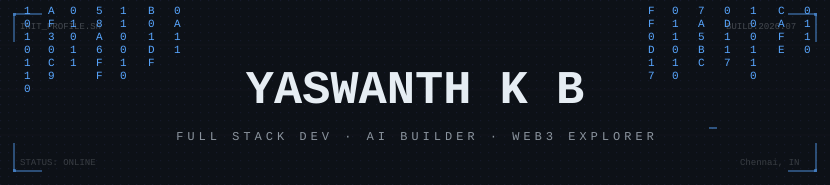

<div align="center">



<br/>


<br/><br/>


&nbsp;&nbsp;


</div>

<br/>


## `> whoami`

```console
Name    : Yaswanth K B
Location: Chennai, India  🇮🇳
Role    : Full Stack Developer & AI Builder
Focus   : AI Orchestration · RAG Systems · Web3
Mail    : yaswanthkb2907@gmail.com
Web     : yaswanthkb.dev
```

- 🔭 Currently building **AI-powered apps & RAG chatbots**
- 🌱 Exploring **Web3, Blockchain & multi-chain integrations**
- 💡 Passionate about **AI Orchestration Platforms**
- ⚡ Stack: **Next.js · Node.js · TypeScript · Python**
- 🤖 AI: **LangChain · PyTorch · Groq · Streamlit**

<br/>


## `> ls tech/`

<div align="center">

**[ Languages ]**


<br/>

**[ Frontend ]**


<br/>

**[ Backend & Databases ]**


<br/>

**[ AI / ML ]**


&nbsp;


<br/>

**[ DevOps & Tools ]**


</div>

<br/>


## `> git log --stats`

<div align="center">


&nbsp;


<br/><br/>


</div>

<br/>


## `> achievement --list`

<div align="center">


</div>

<br/>


## `> cat activity.log`

<div align="center">


</div>

<br/>


## `> snake --contribute`

<div align="center">

<picture>
  <source media="(prefers-color-scheme: dark)" srcset="https://raw.githubusercontent.com/yaswanthme007/yaswanthme007/output/github-contribution-grid-snake-dark.svg">
  <source media="(prefers-color-scheme: light)" srcset="https://raw.githubusercontent.com/yaswanthme007/yaswanthme007/output/github-contribution-grid-snake.svg">
  
</picture>

</div>

<br/>

<div align="center">

<br/>
<code>crafted with ▓▒░ and caffeine · yaswanth k b · 2026</code>
</div>
